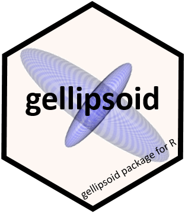
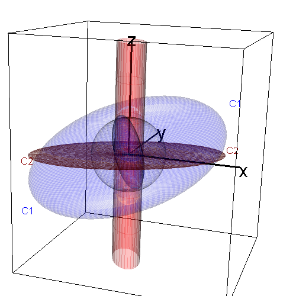
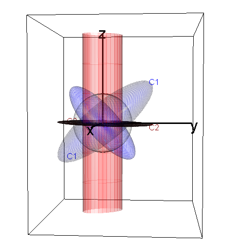

<!--
    math_method:
      engine: webtex
      url: http://chart.apis.google.com/chart?cht=tx&chl=
-->
<!-- README.md is generated from README.Rmd. Please edit that file -->
<!-- badges: start -->

[](https://lifecycle.r-lib.org/articles/stages.html#stable)
[](https://www.gnu.org/licenses/gpl-2.0.html)
[](https://cran.r-project.org/package=gellipsoid)
[](https://cran.r-project.org/package=gellipsoid)

<!-- badges: end -->

# gellipsoid: Generalized Ellipsoids 

The gellipsoid package extends the class of geometric ellipsoids to
“generalized ellipsoids”, which allow degenerate ellipsoids that are
flat and/or unbounded. Thus, ellipsoids can be naturally defined to
include lines, hyperplanes, points, cylinders, etc. The methods can be
used to represent generalized ellipsoids in a $d$-dimensional space
$\mathbf{R}^d$, with plots in up to 3D.

<!-- The motivation for this more general representation is to allow a notation for a class of generalized ellipsoids -->
<!-- that is algebraically closed under -->

The goal is to be able to think about, visualize, and compute a linear
transformation of an ellipsoid with central matrix $\mathbf{C}$ or its
inverse $\mathbf{C}^{-1}$ which apply equally to unbounded and/or
degenerate ellipsoids. This permits exploration of a variety to
statistical issues that can be visualized using ellipsoids as discussed
by Friendly, Fox & Monette (2013), *Elliptical Insights: Understanding
Statistical Methods Through Elliptical Geometry*
<doi:10.1214/12-STS402>.

The implementation uses a $(\mathbf{U}, \mathbf{D})$ representation,
based on the singular value decomposition (SVD) of an
ellipsoid-generating matrix,
$\mathbf{A} = \mathbf{U} \mathbf{D} \mathbf{V}^{T}$, where $\mathbf{U}$
is square orthogonal and $\mathbf{D}$ is diagonal.

For the usual, “proper” ellipsoids, $\mathbf{A}$ is positive-definite so
all elements of $\mathbf{D}$ are positive. In generalized ellipsoids,
$\mathbf{D}$ is extended to non-negative real numbers, i.e.  its
elements can be 0, Inf or a positive real.

#### Definitions

A *proper* ellipsoid in $\mathbf{R}^d$ can be defined by
$\mathbf{E} := \{x \; : \; x^T \mathbf{C} x \le 1 \}$ where $\mathbf{C}$
is a non-negative definite central matrix, In applications, $\mathbf{C}$
is typically a variance-covariance matrix A proper ellipsoid is
*bounded*, with a non-empty interior. We call these **fat** ellipsoids.

A degenerate *flat* ellipsoid corresponds to one where the central
matrix $\mathbf{C}$ is singular or when there are one or more zero
singular values in $\mathbf{D}$. In 3D, a generalized ellipsoid that is
flat in one dimension ($\mathbf{D} = \mathrm{diag} \{X, X, 0\}$)
collapses to an ellipse; one that is flat in two dimensions
($\mathbf{D} = \mathrm{diag} \{X, 0, 0\}$) collapses to a line, and one
that is flat in three dimensions collapses to a point.

An *unbounded* ellipsoid is one that has infinite extent in one or more
directions, and is characterized by infinite singular values in
$\mathbf{D}$. For example, in 3D, an unbounded ellipsoid with one
infinite singular value is an infinite cylinder of elliptical
cross-section.

## Principal functions

- `gell()` Constructs a generalized ellipsoid using the
  $(\mathbf{U}, \mathbf{D})$ representation. The inputs can be specified
  in a variety of ways:

  - a non-negative definite variance matrix;
  - an inner-product matrix
  - a subspace with a given span
  - a matrix giving a linear transformation of the unit sphere

- `dual()` calculates the dual or inverse of a generalized ellipsoid

- `gmult()` calculates a linear transformation of a generalized
  ellipsoid

- `signature()` calculates the signature of a generalized ellipsoid, a
  vector of length 3 giving the number of positive, zero and infinite
  singular values in the (U, D) representation.

- `ell3d()` Plots generalized ellipsoids in 3D using the `rgl` package

## Installation 📦

You can install the `gellipsoid` package from CRAN as follows:

``` r
install.packages("gellipsoid")
```

Or, You can install the development version of gellipsoid from
[GitHub](https://github.com/) with:

``` r
# install.packages("remotes")
remotes::install_github("friendly/gellipsoid")
```

## Example 🛠

#### Properties of generalized ellipsoids

The following examples illustrate `gell` objects and their properties.
Each of these may be plotted in 3D using `ell3d()`. These objects can be
specified in a variety of ways, but for these examples the span is
simplest.

A unit sphere in $R^3$ has a central matrix of the identity matrix.

``` r
library(gellipsoid)
(zsph <- gell(Sigma = diag(3)))  # a unit sphere in R^3
#> $center
#> [1] 0 0 0
#> 
#> $u
#>      [,1] [,2] [,3]
#> [1,]    0    0    1
#> [2,]    0    1    0
#> [3,]    1    0    0
#> 
#> $d
#> [1] 1 1 1
#> 
#> attr(,"class")
#> [1] "gell"
signature(zsph)
#>  pos zero  inf 
#>    3    0    0
isBounded(zsph)
#> [1] TRUE
isFlat(zsph)
#> [1] FALSE
```

A plane in $R^3$ is flat in one dimension.

``` r
(zplane <- gell(span = diag(3)[, 1:2]))  # a plane
#> $center
#> [1] 0 0 0
#> 
#> $u
#>      [,1] [,2] [,3]
#> [1,]    1    0    0
#> [2,]    0    1    0
#> [3,]    0    0    1
#> 
#> $d
#> [1] Inf Inf   0
#> 
#> attr(,"class")
#> [1] "gell"
signature(zplane)
#>  pos zero  inf 
#>    0    1    2
isBounded(zplane)
#> [1] FALSE
isFlat(zplane)
#> [1] TRUE

dual(zplane)  # line orthogonal to that plane
#> $center
#> [1] 0 0 0
#> 
#> $u
#>      [,1] [,2] [,3]
#> [1,]    0    0    1
#> [2,]    0    1    0
#> [3,]    1    0    0
#> 
#> $d
#> [1] Inf   0   0
#> 
#> attr(,"class")
#> [1] "gell"
signature(dual(zplane))
#>  pos zero  inf 
#>    0    2    1
```

A hyperplane. Note that the `gell` object with a center contains more
information than the geometric plane.

``` r
(zhplane <- gell(center = c(0, 0, 2), 
                 span = diag(3)[, 1:2]))  # a hyperplane
#> $center
#> [1] 0 0 2
#> 
#> $u
#>      [,1] [,2] [,3]
#> [1,]    1    0    0
#> [2,]    0    1    0
#> [3,]    0    0    1
#> 
#> $d
#> [1] Inf Inf   0
#> 
#> attr(,"class")
#> [1] "gell"
signature(zhplane)
#>  pos zero  inf 
#>    0    1    2

dual(zhplane)  # orthogonal line through same center
#> $center
#> [1] 0 0 2
#> 
#> $u
#>      [,1] [,2] [,3]
#> [1,]    0    0    1
#> [2,]    0    1    0
#> [3,]    1    0    0
#> 
#> $d
#> [1] Inf   0   0
#> 
#> attr(,"class")
#> [1] "gell"
```

A point:

``` r
zorigin <- gell(span = cbind(c(0, 0, 0)))
signature(zorigin)
#>  pos zero  inf 
#>    0    3    0

# what is the dual (inverse) of a point?
dual(zorigin)
#> $center
#> [1] 0 0 0
#> 
#> $u
#>      [,1] [,2] [,3]
#> [1,]    0    0    1
#> [2,]    0    1    0
#> [3,]    1    0    0
#> 
#> $d
#> [1] Inf Inf Inf
#> 
#> attr(,"class")
#> [1] "gell"

signature(dual(zorigin))
#>  pos zero  inf 
#>    0    0    3
```

<!-- You'll still need to render `README.Rmd` regularly, to keep `README.md` up-to-date. `devtools::build_readme()` is handy for this. You could also use GitHub Actions to re-render `README.Rmd` every time you push. An example workflow can be found here: <https://github.com/r-lib/actions/tree/v1/examples>. -->

#### Drawing generalized ellipsoids

The following figure shows views of two generalized ellipsoids. $C_1$
(blue) determines a proper, fat ellipsoid; it’s inverse $C_1^{-1}$ also
generates a proper ellipsoid. $C_2$ (red) determines an improper, flat
ellipsoid, whose inverse $C_2^{-1}$ is an unbounded cylinder of
elliptical cross-section. $C_2$ is the projection of $C_1$ onto the
plane where $z = 0$. The scale of these ellipsoids is defined by the
gray unit sphere.



This figure illustrates the orthogonality of each $C$ and its dual,
$C^{-1}$. 

## References

Friendly, M., Monette, G. and Fox, J. (2013). Elliptical Insights:
Understanding Statistical Methods through Elliptical Geometry.
*Statistical Science*, **28**(1), 1–39. [Online
paper](https://www.datavis.ca/papers/ellipses-STS402.pdf);
[DOI](https://doi.org/10.1214/12-STS402)

Friendly, M. (2013). Supplementary materials for “Elliptical Insights
…”, <https://www.datavis.ca/papers/ellipses/>
